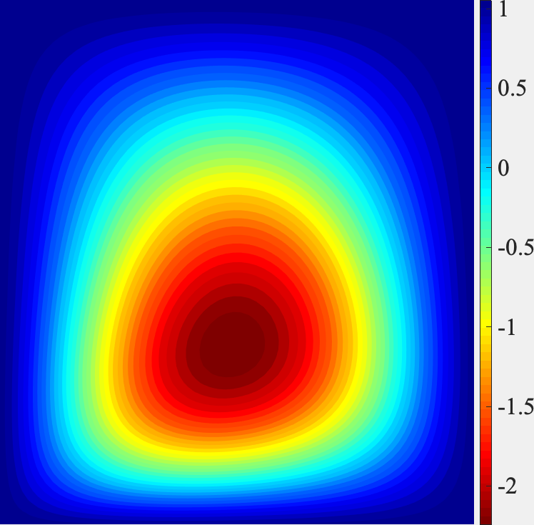

# DeepCNNs-surrogate-UQ
The repository contains all files of the *CACAIE paper* entitled **Deep convolutional neural networks for uncertainty propagation in random fields**. Browse each of the folders for more information.
* The Examples folder provides the computer codes.
* The Responses folder provides peer reviews from 9 reviewers.
* The Manuscript folder provides the revised paper.

## Summary
A machine learning approach is proposed for quantifying the effect of spatial variabilities in coupled elliptic systems. The learning model takes a hierarchical form where deep convolutional neural networks are used as the underlying components.

<p>  <p>

The learning process of this field-to-field mapping is efficient as distant connections among nonadjacent layers are established to improve the model efficiency in terms of training and deploying.

<p><p>

## Citation
The paper has been accepted by the Journal of Computer-Aided Civil and Infrastructure Engineering. The below information contains the references of the arXiv and Journal, respectively. 

```latex
@article{luo2019deep,
  title={Deep convolutional neural networks for uncertainty propagation in random fields},
  author={Luo, Xihaier and Kareem, Ahsan},
  journal={arXiv preprint arXiv:1907.11198},
  year={2019}
}
```


## Dependency
* Python 3.0
* TensorFlow 1.3
* Matplotlib 3.0
* Scipy 1.3
* Numpy 1.10

## Dataset
`
The size of the source data is larger than the github capacity. We are working on providing an easy-to-access link for retrieving data.
`
